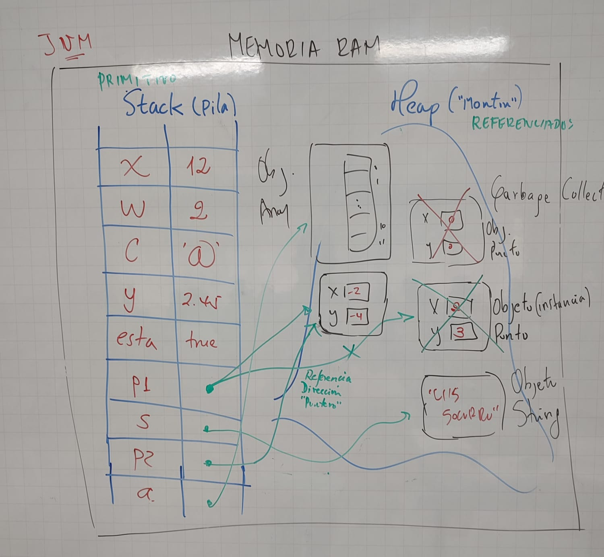

# Tipo de datos en java

### JVM(java virtual machine)

* Realiza una gestin eficiente de la memorian 
*  distribuye la memoria en dos zonas:
* stock(pila) y heap (monton)

## stack
* se almacenan: variables locales, llamadas a metodos(parametros y resultados=), variables primitivas, referencias a objetos del heap.
* memoria estatica.

## heap
* es gestionado por el garbage collector.
* espacio de memoria en tiempo de ejecucion donde se registran los objetos.
* es una memoria dinamica.
* no posee estructura de asignacion de espacios.

## variable
* contenedor de memoria donde se almacena informacion.
* en java se declara con un tipo que se conservara durante todo su ciclo de vida.
* en el interior de la aplicacion. 
* la variable debe tener un nombr.
* existe de tipo primitivo y referenciado.

## Primitivos
* contenedores de tamaño especifico que almacena valores y no tienen metodos.
* ejemplo boolean, char, byte, short, long, float, double.

## Referenciales
* almacenaa las referencias a los datos.
* estos atos se escriben en una zona de memoria llamada heap.
* accesible desde otras distancias de clases.
* su ciclo de vida termina cuando no se necesita mas.
* mientras exista una referencia activa, en la zona de datos esta se mantendra.
* tan pronto como no haya mas referencias, las zonas se consideran utilizada y se procede a su destruccion por parte de l Garbage collector.
* Un tipo refenciado puede no referenciar nada -> null .
* el operador new es para la instanlacion de una clase. Reserva una direccion de una area de memoria.

## Variable de referencia
* Caracteriza una instancia de clase, es decir la direccion donde esta el objeto.
* contiene la direccion de un objeto, cuyo valor por defecto es null.
* durante una prieba e igualdad entre dos variables por referencia, son las direcciones de los objetos que se compara, y no el contenido de los objetos de si mismos.
* cuando se usa una referencia como argumento de un metodo es la doreccion del objeto lo que se pasa, y no el objeto en si mismo.
